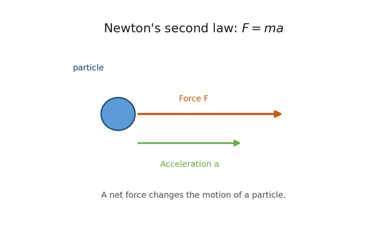

<details open>
    <summary>
        <span style="font-size: 24px;">
            <strong>Harmonic Potential</strong>
        </span>
    </summary>

<details open>
    <summary>
        <span style="font-size: 18px;">
            <strong>Newton's Second Law of Motion</strong>
        </span>
    </summary>

Motion in classical mechanics starts from **Newton's second law of motion**:
```math
F = ma \tag{1}
```

where `F` is force, `m` is mass, and `a` is acceleration.
This tells us that when a force acts on a particle, the particle changes its motion.

To describe motion, we first define **position** `x(t)` as a function of time.
From position, we define **velocity** as the rate of change of position:
```math
v = \frac{dx}{dt} \tag{2}
```

and **acceleration** as the rate of change of velocity:
```math
a = \frac{dv}{dt} = \frac{d^2x}{dt^2} \tag{3}
```

<p align="center"></p>

</details>

<details>
    <summary>
        <span style="font-size: 18px;">
            <strong>Kinetic Energy</strong>
        </span>
    </summary>

When a particle moves, it has **kinetic energy** (how fast it is moving):
```math
K = \frac{1}{2}mv^2 \tag{4}
```

<details><summary><span style="font-size: 12px;"><strong>Why does kinetic energy have this form?</strong></span></summary>

It can be written as $K=\frac{1}{2}mv^2$.

We can derive this from the definition of **work**.
If a force moves a particle by a small distance `dx`, then the small amount of work done is:

```math
dW = F \, dx \tag{5}
```

Using Newton's second law, `F = ma`, we get:
```math
dW = ma \, dx \tag{6}
```

Now use the definitions of acceleration and velocity, so that
```math
a = \frac{dv}{dt} = \frac{dv}{dx}\frac{dx}{dt} = v\frac{dv}{dx} \tag{7}
```

Substitute this into the work expression:
```math
dW = m\left(v\frac{dv}{dx}\right)dx = mv \, dv \tag{8}
```

Integrating both sides gives:
```math
W = \int mv \, dv = \frac{1}{2}mv^2 + C \tag{9}
```

If we choose the kinetic energy to be zero when the particle is at rest, then `C=0`, and we obtain:
```math
K = \frac{1}{2}mv^2 \tag{10}
```

So the familiar expression for kinetic energy comes from the work done by a force in changing the speed of a particle.

---
</details>

Differentiating, we find for its rate of change:
```math
\begin{aligned}
\frac{dK}{dt}
&= \frac{d}{dt}\left(\frac{1}{2}mv^2\right) \\
&= \frac{d (\frac{1}{2} mv^2)}{dv} \frac{dv}{dt} \\
&= mva \\
&= ma\frac{dx}{dt} \\
&= F\frac{dx}{dt}
\end{aligned} \tag{11}
```

Therefore,
```math
dK = F\,dx \tag{12}
```

So the infinitesimal change in kinetic energy is directly connected to the force acting on the particle through an infinitesimal displacement.

Integrating with respect to time, we find
```math
K = \int F\,dx = \frac{1}{2}mv^2 + C \tag{13}
```

</details>

<details>
    <summary>
        <span style="font-size: 18px;">
        <strong>From Total Energy to Potential Energy</strong>
        </span>
    </summary>

The **first law of thermodynamics** tells us that energy is neither created nor destroyed.
For a closed system, the total mechanical energy is constant, so we write

```math
E = K + V \tag{14}
```

If the total energy does not change, then its differential must satisfy

```math
dE = dK + dV = 0 \tag{15}
```

Rearranging gives

```math
dV = -dK = -F\,dx \tag{16}
```

This is the differential relation between force and potential energy. It tells us that when the force increases the kinetic energy, the potential energy must decrease by the same amount.

For a **conservative force**, this relation allows us to define the force from the potential energy function. In one dimension,

```math
F(x) = -\frac{dV(x)}{dx} \tag{17}
```

This means that the force is the negative rate of change of the potential energy with respect to position. In other words, the force points in the direction of decreasing potential energy.

</details>

<details>
    <summary>
        <span style="font-size: 18px;">
        <strong>Harmonic Oscillator</strong>
        </span>
    </summary>

A very important model in physics is the **harmonic oscillator**.
Here, **oscillator** means a system that moves back and forth around an equilibrium position. **Harmonic** means that the restoring force is linearly proportional to the displacement from equilibrium.

In other words, when the particle is displaced farther from equilibrium, the restoring force becomes proportionally larger.
Here, the restoring force is proportional to the displacement from equilibrium:

```math
F = -k(x-x_0) \tag{18}
```

where `k` is the spring constant and `x_0` is the equilibrium position.
The minus sign means the force always pulls the particle back toward equilibrium.

Using the relation between force and potential energy,

```math
F(x) = -\frac{dV}{dx} \tag{19}
```

we get:

```math
-\frac{dV}{dx} = -k(x-x_0) \tag{20}
```

so

```math
\frac{dV}{dx} = k(x-x_0) \tag{21}
```

Integrating with respect to `x`,

```math
V(x) = \frac{1}{2}k(x-x_0)^2 + C \tag{22}
```

where `C` is a constant.
Usually we choose the zero of energy so that `C=0`, giving:

<div style="border: 2px solid #c55a11; border-radius: 8px; padding: 10px 14px; margin: 12px 0; background: #fff9f4;">

```math
V(x) = \frac{1}{2}k(x-x_0)^2 \tag{23}
```

</div>

This is the **harmonic potential**.
It is a parabola centered at the equilibrium position `x_0`.


</details>

<details>
    <summary><span style="font-size: 18px;"><strong>Harmonic Approximation Near Equilibrium</strong></span></summary>

For a general potential energy function `V(x)`, we often do not know the exact form.
However, near an equilibrium position `x_0`, we can expand it in a Taylor series:

```math
V(x) = V(x_0) + \left.\frac{dV}{dx}\right|_{x_0}(x-x_0)
+ \frac{1}{2}\left.\frac{d^2V}{dx^2}\right|_{x_0}(x-x_0)^2 + \cdots \tag{24}
```

At equilibrium,

```math
\left.\frac{dV}{dx}\right|_{x_0} = 0 \tag{25}
```

so the linear term disappears.
Then, close to equilibrium, the potential energy can be approximated as:

```math
V(x) \approx V(x_0) + \frac{1}{2}\left.\frac{d^2V}{dx^2}\right|_{x_0}(x-x_0)^2 \tag{26}
```

If we define

```math
k = \left.\frac{d^2V}{dx^2}\right|_{x_0} \tag{27}
```

then the approximation becomes:

```math
V(x) \approx V(x_0) + \frac{1}{2}k(x-x_0)^2 \tag{28}
```

If we further choose `V(x_0)=0`, then we recover the familiar harmonic form:

```math
V(x) \approx \frac{1}{2}k(x-x_0)^2 \tag{29}
```

This is why the harmonic oscillator is so important.
Even when the true potential is complicated, near equilibrium it can often be approximated by a harmonic potential.
This is the key idea behind normal mode analysis and elastic network models.


Reference:
Tom W. B. Kibble and Frank H. Berkshire, *Classical Mechanics*, Chapter 2: Linear Motion, Sections 2.1 and 2.2.

</details>

</details>

<details>
    <summary>
        <span style="font-size: 24px;">
            <strong>Mode, vibrational frequency, and vibrational mode</strong>
        </span>
    </summary>

<details>
    <summary>
        <span style="font-size: 18px;">
            <strong>Overview</strong>
        </span>
    </summary>

This section will summarize what a mode is, how vibrational frequency is defined, and what is meant by a vibrational mode.

</details>

</details>

<details>
    <summary>
        <span style="font-size: 24px;">
            <strong>Normal mode analysis</strong>
        </span>
    </summary>

<details>
    <summary>
        <span style="font-size: 18px;">
            <strong>Overview</strong>
        </span>
    </summary>

This section will introduce the basic idea of normal mode analysis and how it is used to describe collective motions.

</details>

</details>
